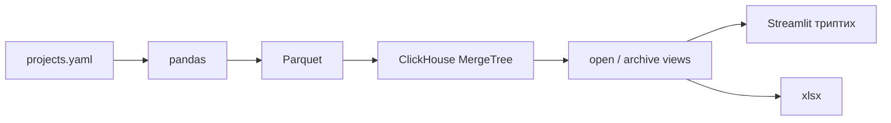

# Персональный дашборд

[](https://www.python.org/)
[](https://clickhouse.com/docs/chdb)
[](https://streamlit.io)
[](LICENSE)

Доска Junior BI-аналитика: **фриланс, работа и хобби** как три отдельных мира.

Резюме перечисляет инструменты. Этот репозиторий показывает, как ими собирается обзор: YAML как источник, pandas как таблица, **ClickHouse SQL** как слой фактов, Excel на выходе, экран на Streamlit.

Смотреть локально. Код: [github.com/ValDagon/personal-dashboard](https://github.com/ValDagon/personal-dashboard). Тёмная ops HUD: фриланс янтарь, работа розовый, хобби циан.

```
+---------------- /now ------------------+
| Фриланс: … · статус                    |
| Работа:  … · статус                    |
| Хобби:   … · статус                    |
+----------------------------------------+
|  открыто / мир   свежесть в днях       |
+------------------+------------------+------------------+
| ФРИЛАНС          | РАБОТА           | ХОББИ            |
| сейчас/очередь/  | честная карточка | открытые         |
| пауза            | роли, без кейсов |                  |
| [архив свёрнут]  |                  | [архив свёрнут]  |
+------------------+------------------+------------------+
```

На узком экране миры — вкладки, не общая лента.

## Зачем так, а не канбан из задач

Карточка = **целый проект**. Наниматель за десять секунд видит, чем я занят в трёх жизнях сразу, и может провалиться в стек и ссылку. Закрытое не шумит: оно в архиве мира.

Проекты найма в публичную доску не выкладываю. В колонке «Работа» одна честная карточка роли.

## Стек

| Слой | Чем | Зачем именно это |
|---|---|---|
| Источник | YAML | Карточки живут в git, без базы с секретами |
| Таблица | pandas | Нормализация, Excel, сверка с SQL |
| SQL | **ClickHouse** через [chDB](https://clickhouse.com/docs/chdb) | Тот же диалект, что на сервере ClickHouse. `MergeTree`, `LowCardinality`, `countIf`, `dateDiff`. Клон репо не требует Docker |
| Экран | Streamlit + свой CSS | Триптих, не дефолтная админка |
| График | Plotly | Только то, что считает SQL: открытые и смесь статусов |
| Выгрузка | openpyxl | `.xlsx` открытых карточек |

Не использую Next.js-оболочку и облачный хостинг этой доски.

## Как запустить

```bash
python3 -m venv .venv
source .venv/bin/activate
pip install -r requirements.txt
streamlit run app.py
pytest
```

Откроется http://localhost:8501

## Что умеет экран

- Шапка `/now`: по одной живой строке на мир, со статусом.
- Три числа открытых и средняя «протухлость» в днях — из `dateDiff` в ClickHouse, не из подписи в макете.
- Колонка мира: сейчас → очередь → пауза, затем **свёрнутый архив**.
- Карточка: стек, публичные ссылки, дата обновления, сколько дней прошло.
- Два графика: сколько открыто и как это раскладывается по статусам.
- Кнопка Excel.
- Блок «SQL, которым считаются цифры»: живые запросы и их результат.

## Статусы

| Статус | Где живёт | Смысл |
|---|---|---|
| сейчас | открытые | в работе |
| очередь | открытые | следующее, ещё не взял |
| пауза | открытые | стоит |
| сделано | архив | закрыл сам |
| сдано клиенту | архив | отдал заказчику |

## Данные

`data/projects.yaml` — одна запись на проект.

| Поле | Значения |
|---|---|
| `world` | `freelance` · `work` · `hobby` |
| `status` | `now` · `queued` · `paused` · `done` · `delivered` |
| `public_title`, `blurb`, `stack`, `updated` | публичный текст |
| `links` | только публичные URL |
| `hire_private` | если `true` — колонка найма без выдуманных тикетов |

Имён заказчиков, которых нельзя светить, в файле нет.

## Как устроен SQL

YAML читается в pandas. Снимок уходит в Parquet. ClickHouse поднимает `MergeTree` **внутри процесса**:

```sql
CREATE TABLE projects
(
    id String,
    world LowCardinality(String),
    status LowCardinality(String),
    public_title String,
    blurb String,
    stack String,
    links String,
    updated Date,
    is_open UInt8,
    is_archive UInt8,
    hire_private UInt8
)
ENGINE = MergeTree
ORDER BY (world, status, id)
```

Порядок ключа: сначала мало кардинальности (`world`, `status`), потом `id`. Так устроен разреженный индекс MergeTree.

Дальше представления `open_by_world` / `archive_by_world` и агрегаты вроде:

```sql
SELECT
    world,
    countIf(status = 'now') AS now_n,
    countIf(status = 'queued') AS queued_n,
    countIf(status = 'paused') AS paused_n,
    count() AS open_n,
    round(avg(dateDiff('day', updated, today())), 1) AS avg_stale_days
FROM projects
WHERE is_open = 1
GROUP BY world
ORDER BY world
LIMIT 100
```

На сервере ClickHouse те же запросы работают без правки диалекта. chDB здесь вместо локального кластера: репозиторий должен открываться с `pip install`.



## Карта файлов

```
app.py                 экран
board/load.py          YAML → pandas → ClickHouse
board/engine.py        сессия chDB
board/queries.py       SQL, который виден на доске
board/render.py        HTML трёх миров
board/export.py        Excel
data/projects.yaml     карточки
assets/style.css       токены доски
tests/test_board.py    слой данных + AppTest
```

## Лицензия

MIT. См. [`LICENSE`](LICENSE).
