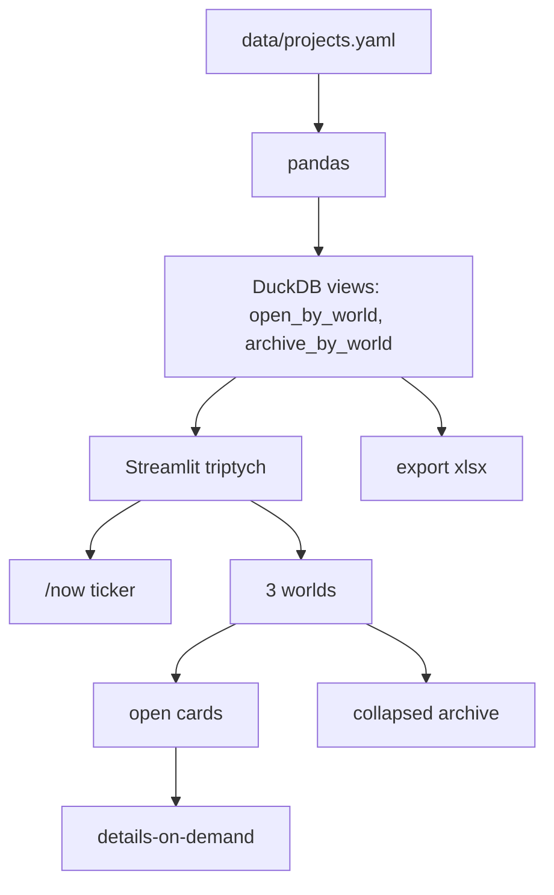

# Product spec · three-worlds

> **Status:** review · waits for human «утверждаю»  
> **Class:** L · implement only after gate  
> **Vault pointer:** `/Users/valentin/Work/base` → `areas/three-worlds.md`

## North-star

Один публичный экран, по которому наниматель за 10 секунд видит три отдельные рабочие жизни Junior BI-аналитика — фриланс, найм, хобби — и может провалиться в целый проект, а не в список тасков.

## Контекст

| Факт | Следствие |
|---|---|
| Портфолио к резюме, GitHub public | README нанимает; живой URL; без секретов и без имён клиентов до гейта |
| Стек найма: Python, pandas, Excel, SQL, Tableau Desktop, ClickHouse | Приложение = Python BI, **не** Next.js/Relomap |
| adult-bi уже содержит Streamlit как запасной UI | Streamlit + pandas + DuckDB — буквальный стек кейса, не выдумка |
| Три мира, единица = целый проект, все открытые, архив сворачивается | IA жёсткая: 3 колонки / 3 таба, карточка = проект |
| Данные из знаний vault, не пустая форма | YAML — SSOT; агент наполняет, человек правит факты |

## DoD

- [ ] Три мира визуально разделены всегда (desktop columns, mobile tabs). Никогда один фид.
- [ ] Карточка = один заказ/проект целиком. Статусы: сейчас / очередь / пауза / сделано / сдано клиенту.
- [ ] Все не-закрытые видны без фильтра «фокус на одном».
- [ ] Сделано + сдано клиенту — в свёрнутом архиве мира.
- [ ] Шапка `/now`: по одной строке на мир (Sivers), дата обновления.
- [ ] Drill-in: стек-бейджи, 3–5 предложений, ссылка только на **публичный** артефакт.
- [ ] Данные из YAML → pandas → DuckDB SQL-вью (показать SQL как скилл).
- [ ] Экспорт открытых карточек в `.xlsx` (openpyxl) — сдача «как аналитик».
- [ ] README: what/why, stack, how to run, architecture, legend, screenshot placeholder.
- [ ] Нет секретов, нет выдуманных KPI.
- [ ] 375px держит раскладку. `prefers-reduced-motion`.

## Non-goals

| Не делаем | Почему |
|---|---|
| Obsidian Dataview / плагины vault | бриф 14: отдельное веб-приложение |
| Next.js, Relomap-стек, Vercel frontend | не стек найма BI |
| Tableau Cloud MCP / `.twbx` как раннер | Desktop-only; workbook можно упомянуть later, не v1 |
| ClickHouse Cloud в проде этого репо | тесный диск; v1 = DuckDB local |
| Четвёртая колонка Crystal OS | ОС — не мир, пока человек не сказал «хобби» |
| Quantified-self (шаги, сон, банк) | другой жанр; ломает костяк |
| Канбан-таски внутри проекта | единица = целиком |
| Логины, OAuth, live API бирж | секреты + не портфолио-демо |
| Копирование имён заказчиков без гейта | публичный GitHub |

## Как работает

### Layout (locked — вопрос 8)

Desktop: **триптих** — три равные вертикальные колонны Freelance | Work | Hobby. Сверху узкая лента `/now` (три факта + `updated`). Внутри колонны сверху вниз: сейчас → очередь → пауза, затем `
` архив.

Mobile: segmented control переключает **мир** (не смешивает карточки). Архив внутри мира.

Signature: колонки как смены на складе / whiteboard смен, не SaaS-hero. Типографика: IBM Plex Sans + IBM Plex Mono (аналитический вернакуляр, не Inter). Цвета: бумага `#EEF1F4`, чернила `#1A2332`, акцент мира — охра / сталь / мох. Без фиолетового градиента, без cream+serif terracotta, без acid-green на чёрном.

Overview → zoom (мир) → details (карточка): Shneiderman 1996.

## Инварианты

1. Три мира XOR один фид.
2. ⛔ Секреты, токены, `.env`, имена клиентов до гейта.
3. ⛔ Next.js.
4. ⛔ Четвёртая жизнь.
5. Честные числа: если метрики нет — прочерк, не «+47%».
6. Код только в этом репо. Vault — указатель.

## Риски

| Риск | Снятие |
|---|---|
| Streamlit выглядит как все демо 2023 | Спрятать хром, токены CSS, hallmark; skill `improving-streamlit-design` |
| Публичный GitHub светит заказчиков | YAML `public_title`; `gh repo create` после гейта |
| Мир Work пустой (найм не назван) | карточка-заглушка «BI seat» с низкой уверенностью + вопрос человеку |
| Tableau не в рантайме | в README: «зерно как у Tableau dashboard»; опциональный `.twbx` later |
| Выдуманные кейсы с визитки | только то, что есть в vault; остальное `unverified` |

## Метрики успеха

Наниматель открыл README или live URL и за 30 секунд понял: кто, три мира, чем стек BI, как запустить. Не: «ещё один Streamlit template».

## Next

1. Человек правит спеку / инвентарь / публичные имена.
2. «утверждаю» → `streamlit/agent-skills` (предложить «ставь») → implement UI.
3. `gh repo create ValDagon/three-worlds --public` только после анонимизации.

## Открытые вопросы (блокируют public git, не локальный каркас)

См. README и отчёт агента: имена найма; adult-bi = Work или Hobby; Crystal OS в Hobby?; публичные названия заказов; язык UI RU/EN.
