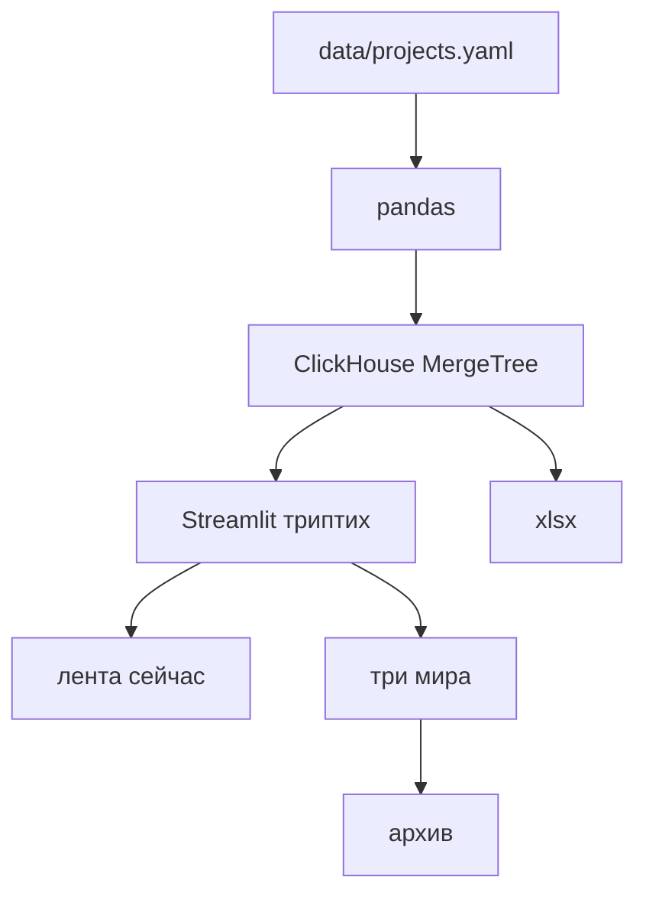

# Спека · три мира

> **Статус:** canonical · гейт человека 2026-08-25 (язык RU, GitHub only, политика имён, работа без кейсов найма)

## North-star

Один публичный экран, по которому наниматель за 10 секунд видит три отдельные рабочие жизни Junior BI-аналитика — фриланс, найм, хобби — и может провалиться в целый проект.

## Контекст

| Факт | Следствие |
|---|---|
| Портфолио к резюме, GitHub public | README на русском; без облачного хостинга доски |
| Стек найма: Python, pandas, Excel, SQL, Tableau Desktop | Приложение = Python BI, не Next.js |
| Три мира, единица = проект, все открытые, архив сворачивается | Три колонки / вкладки |
| Relomap и визитка — реальные имена | URL визитки и Relomap можно |
| HR-бот без фамилий; прочие заказчики скрыты | Нет фамилий и отказанных заказов с сессиями |
| Кейс Adult Income | Мир хобби, в архиве (`done`) |
| Личная визитка | Хобби, статус пауза |
| Проекты найма неизвестны | Одна честная карточка роли, без выдуманных тикетов |

## DoD

- [x] Три мира разделены (колонки ≥900px, вкладки уже)
- [x] Карточка = проект. Статусы: сейчас / очередь / пауза / сделано / сдано клиенту
- [x] Все не-закрытые видны
- [x] Сделано + сдано клиенту в свёрнутом архиве
- [x] Шапка `/now` по миру + дата
- [x] Drill-in: стек, текст, публичные ссылки
- [x] YAML → pandas → ClickHouse (chDB MergeTree)
- [x] Экспорт открытых в `.xlsx`
- [x] README: зачем, стек, запуск, модель, легенда
- [x] Нет секретов и выдуманных KPI
- [x] Свежесть карточек и смесь статусов считаются ClickHouse SQL, не вручную
- [x] Блок живых SQL-запросов на экране

## Non-goals

| Не делаем | Почему |
|---|---|
| Next.js как оболочка доски | не стек найма |
| Vercel / Streamlit Cloud | выкладка только GitHub |
| Tableau Cloud | Desktop-only |
| Четвёртая колонка личных ОС | гейт человека |
| Выдуманные кейсы найма | человек не знает, что публиковать |
| Имена скрытых заказчиков | публичный git |

## Как работает

## Инварианты

1. Три мира, не один фид.
2. Нет секретов и токенов.
3. Нет Next.js-оболочки.
4. Нет четвёртой жизни.
5. Честные числа: счёт открытых из YAML, не «+47%».
6. UI на русском.

## Next

Поддерживать YAML. Скриншоты в README — после локального прогона.
